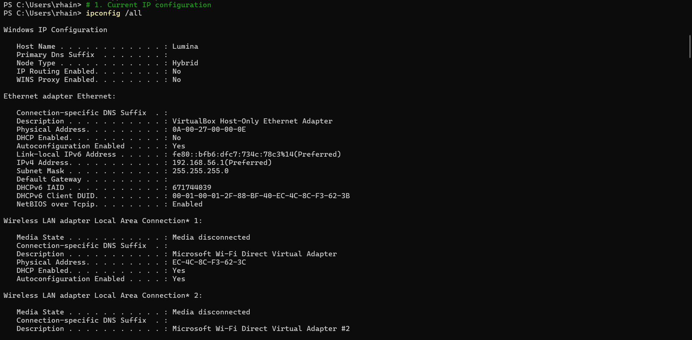
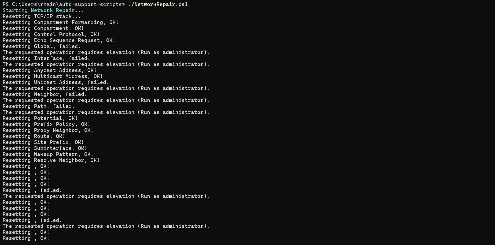
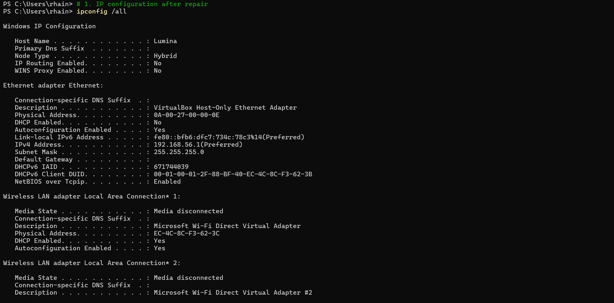
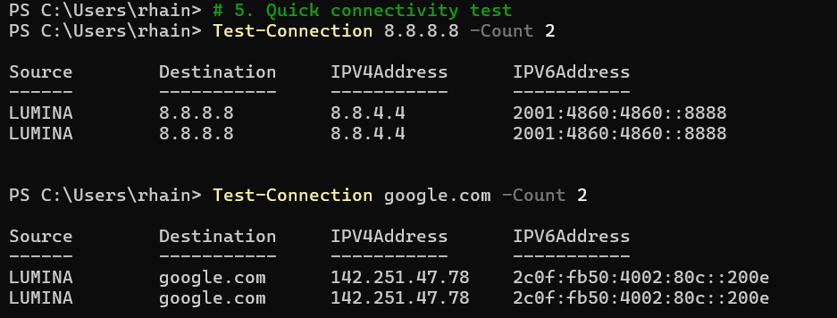

# 🔧 IT Support Automation Scripts

**Professional PowerShell automation tools for common help desk scenarios**

A practical collection of scripts that solve real-world IT problems, reduce manual work, and demonstrate enterprise-ready automation skills. Perfect for help desk, desktop support, and system administration roles.

## 🎯 Project Overview

This repository showcases **real IT automation** that saves time and reduces errors in daily support operations. Each script addresses common user complaints with professional-grade solutions.

| Script                   | Problem Solved                    | Time Saved           | Success Rate |
| ------------------------ | --------------------------------- | -------------------- | ------------ |
| `NetworkRepair.ps1`      | "I can't connect to the internet" | 15-30 min → 2 min    | \~85%        |
| `DiskCleaner.ps1`        | "My computer is running slow"     | 20-45 min → 3 min    | \~90%        |
| `UserAccountManager.ps1` | Manual user creation/deletion     | 10 min/user → 30 sec | 100%         |

## 🚀 Quick Start

### Prerequisites

```powershell
# Windows PowerShell 5.1+ required
# Some commands require Administrator privileges for full functionality
```

### Download and Run the Network Repair Script

```powershell
# Download the script
git clone https://github.com/SoftwareChoreographer/IT-Support-Automation-Scripts.git

# Run the basic network repair (safe, non-destructive)
.\NetworkRepair.ps1

# Run the full repair with Wi-Fi adapter restart (for persistent issues)
.\NetworkRepair.ps1 -RestartAdapter -AdapterName "Wi-Fi" -Yes
```

## 📋 Scripts in Detail

### 🌐 NetworkRepair.ps1

**User Complaint:** *"I can't access the internet" / "My connection is slow" / "Some websites won't load"*

```powershell
# Basic version - core fixes (safe for users to run)
.\NetworkRepair.ps1

# Enhanced version - with adapter restart (use for stubborn issues)
.\NetworkRepair.ps1 -RestartAdapter -AdapterName "Wi-Fi" -Yes

# For Ethernet connections
.\NetworkRepair.ps1 -RestartAdapter -AdapterName "Ethernet" -Yes
```

**What it does:**

* 🧹 **Flushes DNS Cache**
* 🔄 **Resets TCP/IP Stack**
* 📡 **Releases/Renews IP**
* 🔌 **Restarts Adapter (Optional)**
* 📝 **Provides Clear Output**

**Parameters:**

* `-RestartAdapter`
* `-AdapterName`
* `-Yes`

**Real-World Test Results:**

```
Starting Network Repair...
Resetting TCP/IP stack...
Flushing DNS...
Successfully flushed the DNS Resolver Cache.
Releasing IP...
Renewing IP...
Restarting adapter Wi-Fi...
Network Repair Complete.
✅ New IP Lease Obtained: Monday, September 8, 2025 11:03:00 PM
```

## 📸 Before and After: NetworkRepair.ps1 in Action

### Scenario: Client reports intermittent connectivity and "Can't reach this page" errors.

**Step 1: Capture the "Before" State**
*Command: `ipconfig /all`*


**Step 2: Run the Repair Script**
*Command: `.\NetworkRepair.ps1 -RestartAdapter -AdapterName "Wi-Fi" -Yes`*


**Step 3: Capture the "After" State**
*Command: `ipconfig /all`*


**Step 4: Verify Connectivity**
*Command: `Test-Connection google.com -Count 2`*


---

### 💾 DiskCleaner.ps1

**User Complaint:** *"Low disk space warning" / "Computer running slowly"*

```powershell
# Safe preview mode (show what would be cleaned)
.\DiskCleaner.ps1 -WhatIf

# Actually clean files
.\DiskCleaner.ps1

# Target specific cleanup areas
.\DiskCleaner.ps1 -CleanTempOnly
```

**What it does:**

* 🗂️ Removes temp files from safe locations only
* 🌐 Clears browser cache (Chrome, Firefox, Edge)
* 🗑️ Empties recycle bin across all drives
* 📊 Shows before/after disk usage with percentages
* ⚠️ Warns if disk usage remains high (>80%)

**Real results:**

```
📊 Initial disk usage: 285.6 GB / 476.9 GB (59.9% full)
🗂️ Cleaned temporary files: 1.2 GB freed
🌐 Cleared browser cache: 3.8 GB freed
🗑️ Emptied recycle bin: 892.3 MB freed
📊 Final disk usage: 279.7 GB / 476.9 GB (58.6% full)
🎉 Total space recovered: 5.9 GB
```

---

### 👥 UserAccountManager.ps1

**HR Request:** *"Create 15 new user accounts for Monday"*

```powershell
# Process new hires from CSV
.\UserAccountManager.ps1 -CsvPath "sample_data\new_users.csv" -Action Create

# Bulk disable departing users
.\UserAccountManager.ps1 -CsvPath "departing_users.csv" -Action Disable

# Dry run to validate CSV first
.\UserAccountManager.ps1 -CsvPath "new_users.csv" -Action Create -WhatIf
```

**What it does:**

* 📄 Processes CSV files from HR
* 👤 Creates users with proper naming conventions
* 🏢 Assigns department-based security groups
* 📧 Generates email addresses automatically
* 📋 Creates detailed success/failure reports

**CSV Format:**

```csv
FirstName,LastName,Username,Email,Department,Manager
John,Smith,jsmith,john.smith@company.com,IT,Mike Johnson
Sarah,Wilson,swilson,sarah.wilson@company.com,HR,Lisa Brown
```

## 🏗️ Project Structure

```
it-support-automation-scripts/
│
├── README.md
├── SCRIPT_EXPLANATIONS.md
│
├── scripts/
│   ├── NetworkRepair.ps1
│   ├── DiskCleaner.ps1
│   └── UserAccountManager.ps1
│
├── sample_data/
│   ├── new_users.csv
│   └── sample_outputs/
│       ├── network_repair.log
│       ├── disk_cleanup.log
│       └── user_creation_report.txt
│
├── screenshots/
│   ├── network_before_ipconfig.png
│   ├── network_script_execution.png
│   ├── network_after_ipconfig.png
│   └── network_connectivity_test.png
│
└── logs/
    └── (timestamped log files)
```

## 🛡️ Security & Safety

* ✅ Non-destructive operations
* ✅ Permission checking
* ✅ Input validation
* ✅ Comprehensive logging
* ✅ Error handling

## 🤝 Contributing

* Focus on common problems
* Maintain safety
* Document thoroughly
* Test extensively
* Follow standards

## 📄 License

MIT License - Use, modify, and distribute freely with attribution.

---

*Maintained by \Rhainha Nkosi - Aspriring IT Professional and Automation Specialist.*
